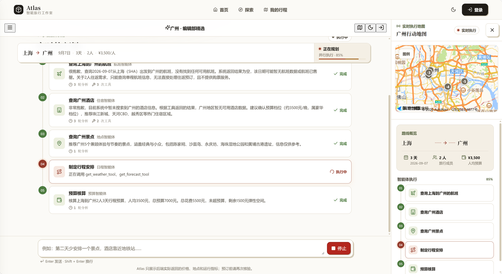
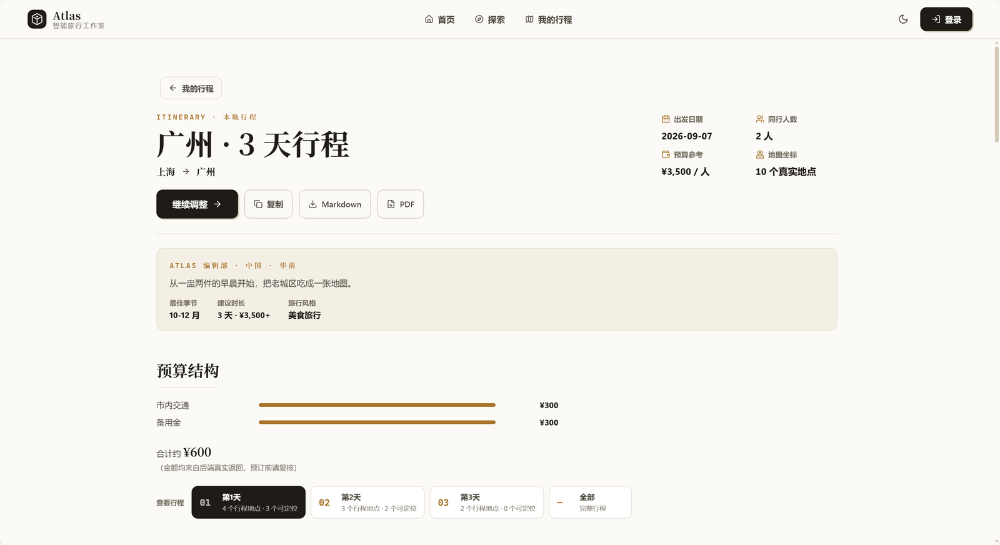

# ✈️ Atlas · 智能旅行工作室

> Plan-and-Execute × Worker 子图 Multi-Agent 旅行规划系统
> 一句话搞定航班、酒店、景点、日程、预算，全程 SSE 流式可视

[](https://www.python.org/)
[](https://fastapi.tiangolo.com/)
[](https://www.langchain.com/langgraph)
[](https://platform.deepseek.com/)
[](https://react.dev/)
[](https://vite.dev/)
[](LICENSE)
[](http://pppyyz12233.top:8000)

🌐 **线上体验：[http://pppyyz12233.top:8000](http://pppyyz12233.top:8000)** —— 无需注册，游客打开即用

---

## 📸 项目预览

| 首页 · 一句话开始 | 移动端适配 |
|:---:|:---:|
|  |   |

|实时执行链 · 高德地图联动 |
|:---:|
| |

| 规划完成 · 杂志风阅读态 |
|:---:|
|  | 


提交一句话后，五位智能体并行开工：进度、每轮工具调用、地图标注全部实时可见；完成后自动进入线性阅读态，可继续对话调整或一键导出。

## 目录

- [功能特性](#功能特性)
- [系统架构](#系统架构)
- [快速开始](#快速开始)
- [生产部署](#生产部署)
- [Worker 与工具](#worker-与工具)
- [安全设计](#安全设计)
- [评测体系](#评测体系)
- [API 一览](#api-一览)
- [项目结构](#项目结构)
- [已知限制](#已知限制)
- [Roadmap](#roadmap)
- [License](#license)

## 功能特性

**多智能体规划**

- **Plan-and-Execute 编排**：主图 7 节点（Guard → Memory → Intent → Plan → Execute → Aggregate → Memory），5 个 Worker 子图按依赖分层并行调度，全程 SSE 流式可视
- **Worker ReAct 循环**：每个 Worker 是独立 StateGraph 子图，自主决定"思考 ↔ 调工具"的轮次，迭代数可配
- **确定性优先的成本控制**：意图路由参数直通 Worker、窄意图跳过 LLM 规划、同城/一日游预过滤、历史瘦身与结构化提取——单次全流程 LLM 调用约 10-20 次
- **长期偏好记忆**：LangGraph Store 跨会话记住目的地偏好、出行节奏，下次规划自动带入

**产品化前端**

- **一句话开始**：不用填表单，"去广州一天"自动解析目的地、天数、出发地
- **地图可视化**：高德地图实时标注航班/酒店/景点检索结果，按天分色连线，可聚焦定位
- **对话继续调整**："改成两天""第二天少排一个景点"随时追问，方案就地更新
- **导出与收藏**：Markdown / PDF（含中文渲染降级链）一键导出；行程可收藏、跨会话恢复
- **游客可用**：无需注册即可完整规划；登录后云端保存历史
- **移动端适配**：375px 起全布局适配，明暗双主题跟随系统

**工程化闭环**

- **带评测集的迭代**：30 条固定用例 + 双层基准评测（离线规则层 / 在线全链路层），量化意图路由、工具召回、错误调用、计划成功率与延迟
- **测试门禁**：前端 179 条（Vitest + Testing Library + Playwright e2e）、后端 44 条（pytest）、ruff + ESLint + pyright 一键门禁

## 系统架构

```
                    ┌─────────────────────┐
                    │  React + Vite 前端   │
                    │  Fetch SSE Stream   │
                    └─────────┬───────────┘
                              │ POST /api/chat/stream
                              ▼
┌──────────────────────────────────────────────────────────┐
│                  LangGraph 主图（7 节点）                  │
│                                                          │
│   guard → memory_reader → intent_router → planner        │
│                                               │          │
│                                               ▼          │
│   ┌──────────────────────────────────────────────┐       │
│   │                  executor                    │       │
│   │        依赖分层并行调度 5 个 Worker 子图         │       │
│   │                                              │       │
│   │  ┌──────┐ ┌──────┐ ┌──────────┐ ┌─────────┐ ┌──────┐
│   │  │flight│ │hotel │ │attraction│ │itinerary│ │budget│
│   │  │ 子图 │ │ 子图 │ │   子图   │ │  子图   │ │ 子图 │
│   │  └──┬───┘ └──┬───┘ └────┬─────┘ └────┬────┘ └──┬───┘
│   │     └────────┴──────────┴────────────┴─────────┘    │
│   │                      │ result                       │
│   └──────────────────────┼──────────────────────────────┘
│                          ▼                              │
│   memory_writer → aggregator → END                      │
│                                                          │
│   持久化：AsyncSqliteSaver（状态）+ AsyncSqliteStore（偏好）│
└──────────────────────────────────────────────────────────┘
```

| 层级 | 模式 | 说明 |
|------|------|------|
| 主 Agent | Plan-and-Execute | Guard → Memory → Intent → Plan → Execute → Aggregate → Memory |
| Worker ×5 | StateGraph 子图 | 每个 Worker 独立 StateGraph，内嵌 LLM ↔ Tool 标准 ReAct 循环（最大迭代数可配） |

## 快速开始

### 环境要求

| 依赖 | 版本 |
|------|------|
| Python | 3.11+ |
| Node.js | 20+（前端构建） |
| DeepSeek API Key | [平台申请](https://platform.deepseek.com/)，必填才能出方案 |

### 安装与配置

```bash
git clone https://github.com/pppyyz12233/atlas-travel-studio.git
cd atlas-travel-studio

# 后端
pip install -r requirements.txt
cp .env.example .env          # 填入 DEEPSEEK_API_KEY 等配置

# 前端
cd frontend
npm install
npm run build                 # 构建产物 dist/ 由 FastAPI 直接托管
cd ..
```

### 环境变量

| 变量 | 说明 | 缺省行为 |
|------|------|---------|
| `DEEPSEEK_API_KEY` | DeepSeek 平台 API Key（必填才能出方案） | 未填可启动、可浏览前端，发起规划时返回明确配置提示 |
| `DEEPSEEK_MODEL` | 模型名 | 默认 `deepseek-chat` |
| `JWT_SECRET` | ≥32 位随机串，`python -c "import secrets; print(secrets.token_urlsafe(48))"` | 开发环境自动回退随机临时密钥（重启失效）并告警；生产环境拒绝启动 |
| `SQLITE_PATH` | 业务库连接串 | 默认 SQLite；置空回退 MySQL 配置 |
| `MAX_TOOL_ITERATIONS` | Worker ReAct 最大迭代数 | 3 |

前端地图（可选）：在 `frontend/.env.local` 配置 `VITE_AMAP_KEY` / `VITE_AMAP_SECURITY_CODE`（[高德开放平台](https://lbs.amap.com/)免费申请）。**必须在 `npm run build` 之前就位**——Key 在构建期内联进产物。

### 启动

```bash
# 方式一（推荐）：模块方式启动，行为与生产部署一致
python -m uvicorn main:app --host 0.0.0.0 --port 8000   # → http://localhost:8000

# 方式二：脚本直启（同样受支持；运行期资源统一挂 app.state，两种方式等价）
python main.py            # → http://localhost:8000

# 方式三：前后端分离开发
python -m uvicorn main:app --port 8000   # 终端 1
cd frontend && npm run dev               # 终端 2 → http://localhost:5173
```

> SQLite 单写者：同一时刻只能跑一个实例，否则报 `database is locked`。
> 启动报 locked 时先找残留进程：`netstat -ano | findstr :8000` → `taskkill /F /PID <pid>`。

## 生产部署

以下为已验证的真实部署路径（Ubuntu VPS + systemd）：

```bash
# 1. 同步代码并构建（frontend/.env.local 必须先就位）
git pull
cd frontend && npm install && npm run build && cd ..

# 2. 验证高德 Key 已内联（应输出 ≥2，为 0 说明 env 未被读到）
grep -oE '[0-9a-f]{32}' frontend/dist/assets/index-*.js | wc -l
```

`/etc/systemd/system/travel-agent.service`：

```ini
[Unit]
Description=Atlas Travel Planning Agent
After=network.target

[Service]
WorkingDirectory=/opt/atlas-travel-studio
ExecStart=/usr/bin/python3.11 -m uvicorn main:app --host 0.0.0.0 --port 8000
Restart=always
RestartSec=3

[Install]
WantedBy=multi-user.target
```

```bash
systemctl daemon-reload
systemctl enable --now travel-agent
journalctl -u travel-agent -f        # 看日志
```

**高德地图上线检查**：在高德控制台将部署域名（如 `pppyyz12233.top`）加入 Key 的安全域名白名单；本地开发用的 localhost 条目保留即可。

## Worker 与工具

| Worker | 工具 | 数据源 |
|--------|------|--------|
| ✈️ flight | search_flights / get_flight_price | 模拟 8 条航班 |
| 🏨 hotel | search_hotels | 模拟酒店库 |
| 🎯 attraction | 无（纯 LLM 推理） | — |
| 📅 itinerary | get_weather / get_forecast | wttr.in 真实天气 |
| 💰 budget | get_exchange_rate | exchangerate-api 真实汇率（失败降级离线汇率表） |

### MCP 双轨制

| 层 | 技术 | 用途 |
|----|------|------|
| 外部 | FastMCP (stdio) | Claude Desktop 等 MCP 客户端 |
| 内部 | `@tool` 注册表（`app/mcp/registry.py`） | Worker 子图直接绑定调用 |

## 安全设计

| 项 | 实现 |
|----|------|
| 认证 | JWT（HS256，24h）+ bcrypt；token 带 `jti`，`POST /auth/logout` 登出吊销（内存黑名单，过期自动清理） |
| 限流 | 登录 5 次/分钟（IP+账号维度）；聊天 20 次/分钟；滑动窗口 + 过期键清理；不信任可伪造的 `X-Forwarded-For` |
| 护栏 | `app/agents/workflow/guard.py` 正则门卫（词边界匹配防误伤，交易/越狱/违规拦截） |
| 上传 | 分块读取边读边限（50MB）、扩展名白名单、文件名 UUID 防覆盖、防路径穿越 |
| 导出 | WeasyPrint 禁止加载外部资源（隔离 LLM 输出中的外链 SSRF 面）；渲染移入线程池不阻塞事件循环 |
| CORS | 仅放行本机开发端口（前端生产模式与后端同源） |

## 评测体系

固定 30 条旅行场景用例（`eval/testcases.json`），双层评测：

**用例构成**

| 类别 | 数量 | 覆盖 |
|------|------|------|
| full_trip 完整规划 | 10 | 国内/海外、亲子、美食、一日游（去酒店）、不住酒店、红叶季 |
| flight_only 只查航班 | 4 | 城市/日期/比价变体 |
| hotel_only 只找酒店 | 4 | 性价比/河景/亲子/位置 |
| attractions_only 只看景点 | 4 | 必去/小众/老人节奏/路线 |
| budget_only 只算预算 | 3 | 海外（含汇率工具）/国内 |
| itinerary_modify 修改行程 | 3 | 减项/换住宿/放宽节奏 |
| guard 拦截 | 2 | 真实交易、越狱提示词 |

**运行**

```bash
# 离线层：校验确定性规则（guard / 城市提取 / Worker 映射 / 预过滤），无需 Key
python eval/run_benchmark.py --mode offline

# 在线层：全链路真实评测（需先启动服务并配置 DEEPSEEK_API_KEY）
python eval/run_benchmark.py --mode online
# 可选：--only full_trip --limit 5 --gap 4 --base-url http://127.0.0.1:8000
```

**离线基线**（确定性规则层，2026-08-29）

| 指标 | 结果 |
|------|------|
| Guard 拦截准确率 | **100%**（30/30） |
| 城市提取准确率 | **100%**（26/26，包含语义） |
| Worker 映射准确率 | **100%**（28/28） |
| 计划预过滤准确率 | **100%**（一日游/不住酒店剔除） |

**在线基线**（30 条全链路真实评测，2026-08-31，报告 `eval/results/online_20260831_160526.json`）

| 指标 | 结果 |
|------|------|
| 意图路由准确率 | **92.9%**（26/28，非 guard 口径） |
| Guard 拦截准确率 | **100%**（2/2） |
| 必须工具召回率 | **91.9%** |
| 可选工具调用率 | 71.4% |
| 错误调用率 | 11.5% |
| 过量调用率 | 21.9% |
| 计划成功率 | **100%**（30/30 含 guard；非 guard 28/28） |
| 延迟 avg / median / P95 | 25.3s / 19.0s / 61.0s |
| LLM 调用均值(估) / 工具调用均值 | 9.6 次/例 / 3.4 次/例（非 guard 口径） |

已知短板：意图失败集中在 full_trip 的两处边界（住宿关键词强于行程语义被路由为 hotel_only；一日游场景 planner LLM 裁掉跨城航班步骤）；过量调用主要来自多步骤复用同一 Worker（去/返程各查一次航班），非无效重试。

## API 一览

| 方法 | 路径 | 说明 |
|------|------|------|
| POST | `/api/chat/stream` | SSE 流式规划（游客可用，Cookie 会话保持上下文） |
| POST | `/api/chat` | 非流式对话 |
| GET | `/api/chat/history?conversation_id=` | 会话消息（需登录，校验归属） |
| GET | `/api/chat/conversations` | 会话列表（需登录） |
| POST | `/api/auth/register` · `/login/email` · `/login/phone` · `/logout` | 注册 / 登录 / 登出吊销 |
| GET | `/api/auth/me` | 当前用户 |
| GET | `/api/export/{id}?format=md\|pdf` | 导出方案（需登录） |
| GET | `/api/search/flights` · `/hotels` · `/attractions` | 结构化搜索（分页） |
| · | `/api/admin/*` | 用户管理、文档上传（需 admin） |

## 项目结构

```
atlas-travel-studio/
├── main.py                          # FastAPI 入口 + Checkpointer/Store 初始化
├── eval/                            # ★ 基准评测
│   ├── testcases.json               #   30 条固定用例（含期望标注）
│   ├── run_benchmark.py             #   离线/在线双层评测脚本
│   └── results/                     #   报告落盘（JSON）
├── frontend/                        # React 18 + Vite 前端（杂志风编辑视觉）
│   ├── src/features/journey/        #   会话/时间线/行程工作台/状态机
│   ├── src/pages/                   #   首页/规划/探索/我的行程/详情
│   └── src/hooks/                   #   SSE / API / 认证 / 主题
├── docs/screenshots/                # README 截图
├── app/
│   ├── agents/                      # ★ Agent 核心
│   │   ├── supervisor.py            #   主图 7 节点 + 分层执行 + 结构化提取
│   │   ├── intent_router.py         #   LLM 意图分类（6 类）
│   │   ├── planner.py               #   计划生成 + 确定性预过滤
│   │   ├── skills/                  #   角色说明书（skills/*.md）
│   │   ├── workers/factory.py       #   build_worker_subgraph() 通用 ReAct 工厂
│   │   └── workflow/guard.py        #   正则安全护栏
│   ├── mcp/
│   │   ├── server.py                #   FastMCP stdio 服务器（外部）
│   │   ├── registry.py              #   @tool 注册表（内部）
│   │   └── servers/                 #   航班 / 酒店 / 天气 / 汇率
│   ├── auth/                        # JWT + bcrypt + 登出黑名单 + 游客 HMAC 会话
│   ├── utils/                       # LLM 客户端 / 配置 / DB / 限流 / PDF
│   ├── models/ · crud/ · schemas/   # ORM / 数据访问 / Pydantic
│   └── routers/                     # chat / auth / admin / export / search
└── uploads/                         # 管理端上传目录（UUID 命名）
```

## 已知限制

- 限流器与 JWT 黑名单为**进程内存态**：多进程部署或重启后失效，生产应换 Redis
- 航班/酒店为模拟数据（天气/汇率为真实 API）；接入真实供应商只需替换 `app/mcp/servers/`
- Guard 为轻量正则第一道防线，深度防护依赖 Worker system prompt
- SQLite 单实例（单写者），高并发场景切 MySQL（`SQLITE_PATH` 置空即用 `DB_URL`）

## Roadmap

- [ ] 限流与 JWT 黑名单迁移 Redis（多进程/多实例前置条件）
- [ ] 航班/酒店接入真实供应商 API
- [ ] Docker 多阶段构建镜像（前端构建 + 后端运行 + 数据卷）
- [ ] MySQL 生产部署文档

## License

[MIT](LICENSE)
